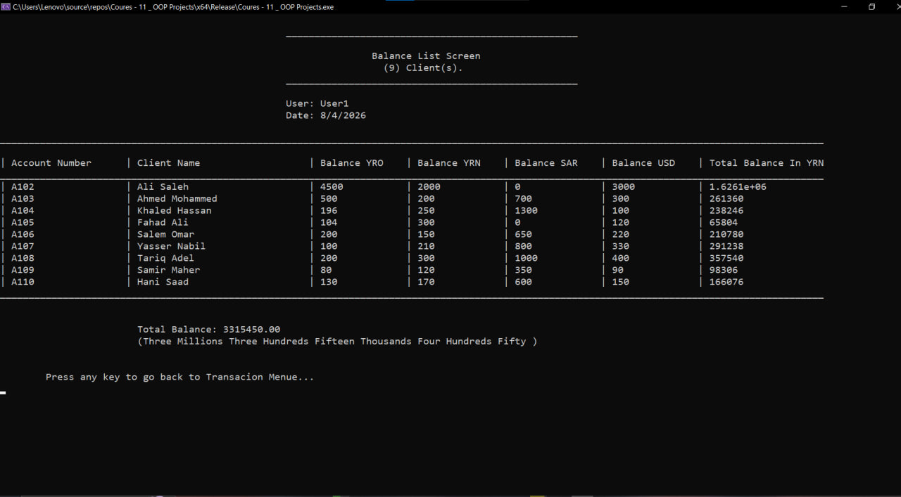
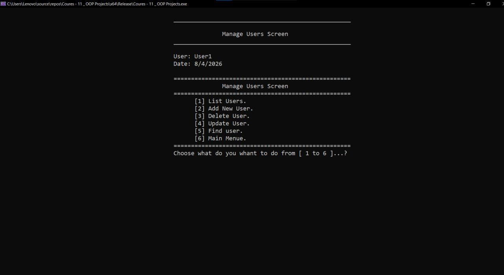
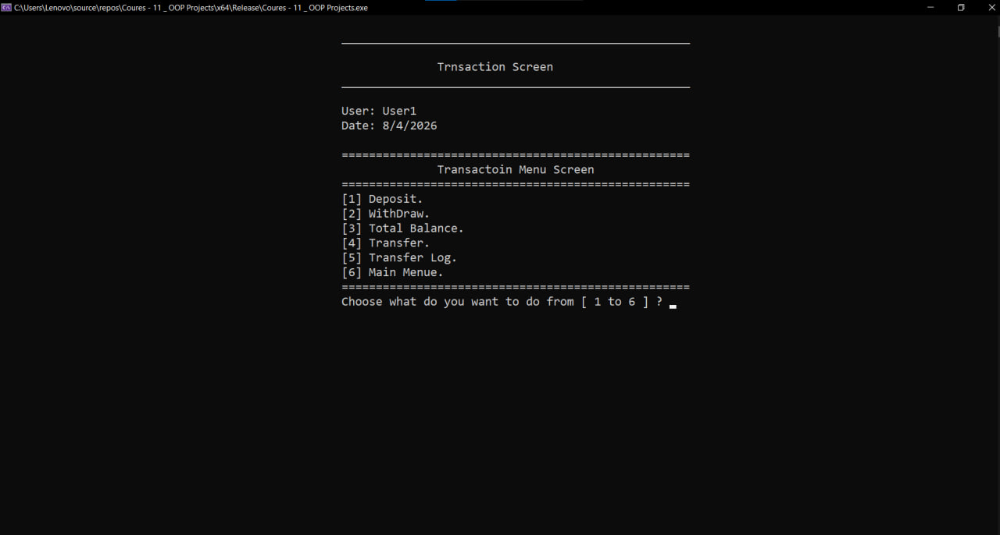
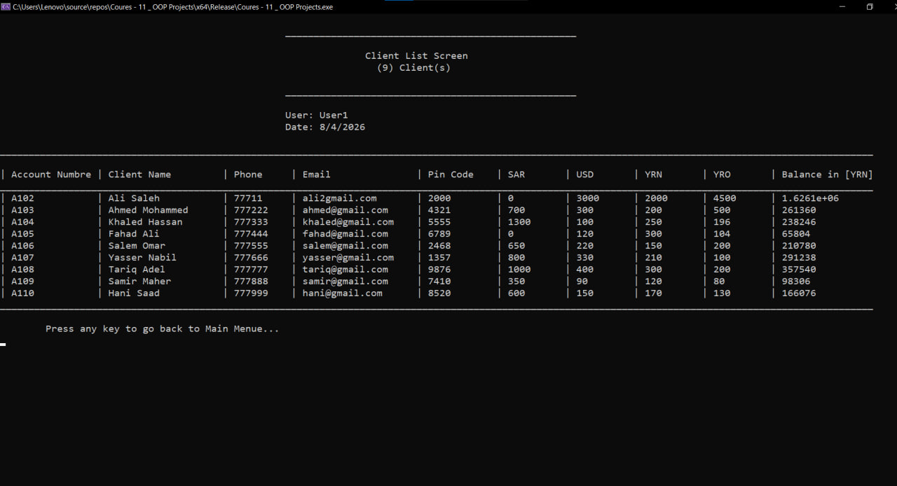
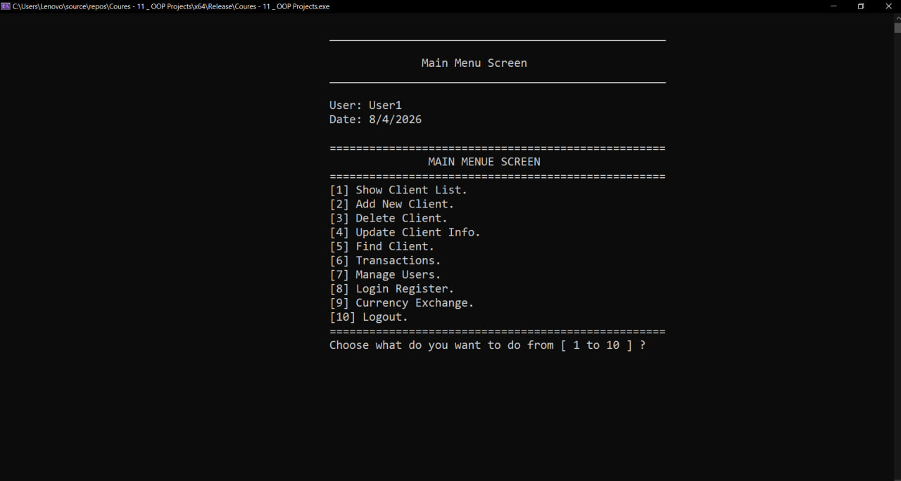
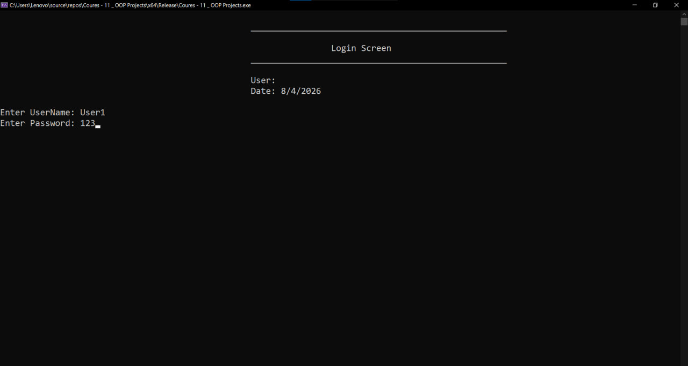

# 
🏦 Advanced Bank Management System (OOP Architecture)

  
  
  

---

## 🏗️ Architectural Overview
This system is a demonstration of **High-Level Software Engineering**. It is built using a **Strict Layered Architecture** to ensure industrial-grade maintainability and scalability.

* **⚡ Logic Layer (Core):** Implements complex financial algorithms, business rules, and state management.
* **🖥️ Presentation Layer (Screens):** High-fidelity UI controllers managing user interaction flow.
* **💾 Persistence Layer (Data):** Optimized file-stream handling for text-based databases with data integrity checks.
* **🛠️ Utility Framework (Lib):** Enterprise-grade validation and custom data structures.

---

## 📊 Architecture Diagram
The system follows a uni-directional flow to ensure data integrity and separation of concerns:

  <b>User Interface (UI) ➡️ Business Logic ➡️ Data Persistence</b>

---

## 🧰 Technologies Used
- **Language:** C++ (Advanced OOP: Encapsulation, Abstraction, Inheritance).
- **Environment:** Visual Studio 2026.
- **UI:** Custom Console-based Graphical Interface (High Contrast/Noir).
- **Storage:** File Handling (Text-based Persistence).
- **Framework:** Custom-built Logic & Validation Library.

---

## 🧪 Example Use Cases
- **Client Management:** Create, update, and manage secure client accounts.
- **Financial Operations:** Real-time Deposit, Withdraw, and Fund Transfer.
- **Security Control:** Manage user permissions and administrative roles.
- **Currency Intelligence:** Convert and manage multi-currency exchange rates.

---

## 🔐 Advanced Security & Integrity
* **Role-Based Access Control (RBAC):** Granular permission matrix for authorized module access.
* **Session Integrity:** Secure handling of user sessions during runtime.
* **Input Sanitization:** Military-grade validation to prevent system exploits.
* **Audit Logging:** Full traceability of every transaction and system log.

---

## 📸 System Visual Walkthrough

  <table border="0">
    <tr>
      <td width="50%"> 
<b>🔐 Secure Authentication</b>
</td>
      <td width="50%"> 
<b>🏢 Executive Dashboard</b>
</td>
    </tr>
    <tr>
      <td width="50%"> 
<b>👥 Client Records</b>
</td>
      <td width="50%"> 
<b>💸 Transaction Engine</b>
</td>
    </tr>
  </table>

  

    
<b>📂 Click here to view more system operations (8+ Images)</b>

     
    <table border="0">
      <tr>
        <td width="50%"> 
<b>📜 Transfer Logs</b>
</td>
        <td width="50%"> 
<b>🔍 Transaction Search</b>
</td>
      </tr>
      <tr>
        <td width="50%"> 
<b>💱 Currency Exchange</b>
</td>
        <td width="50%"> 
<b>🔄 Rate Management</b>
</td>
      </tr>
      <tr>
        <td width="50%"> 
<b>🛡️ Permission Control</b>
</td>
        <td width="50%"> 
<b>👤 User Management</b>
</td>
      </tr>
      <tr>
        <td width="50%"> 
<b>📋 Full Client List</b>
</td>
        <td width="50%"> 
<b>⚙️ System Settings</b>
</td>
      </tr>
    </table>
  

---

## ⚙️ How to Run
1. **Clone/Download:** Get the repository files.
2. **Launch:** Open the `.sln` file in **Visual Studio**.
3. **Build:** Compile the solution to generate the executable.
4. **Execute:** Launch the system and login with default credentials.

---

  <b>Lead Software Engineer: Oday Al-Naqep</b> 
  <i>Crafting robust solutions through logic, discipline, and OOP principles.</i>

