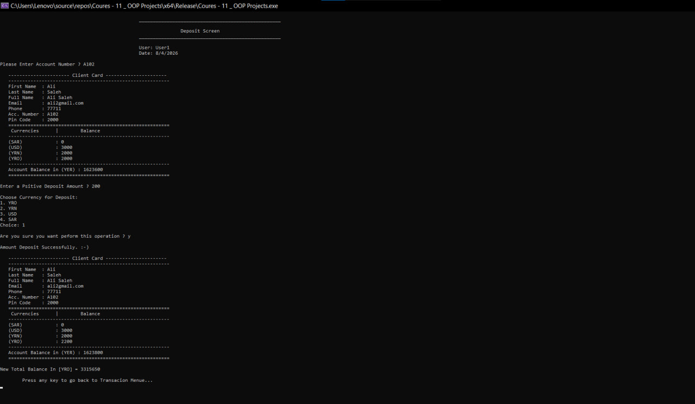
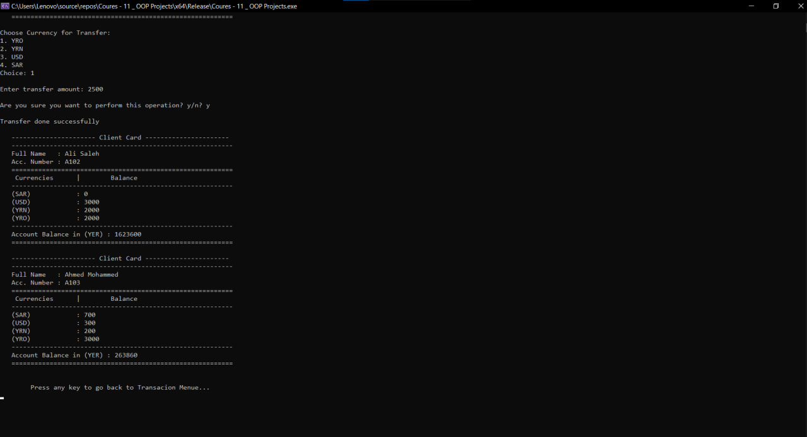
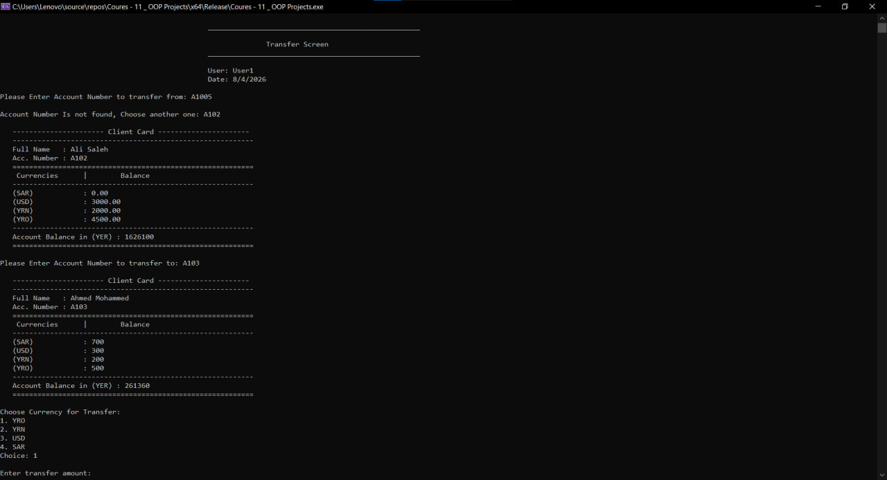
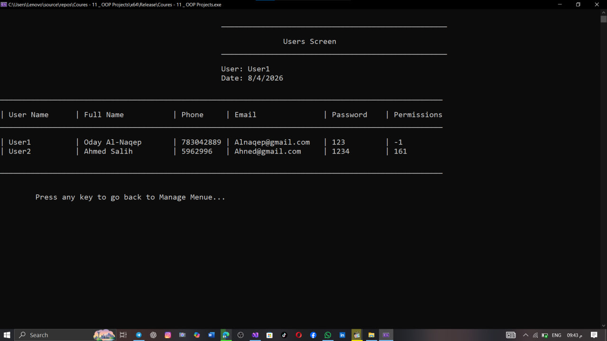
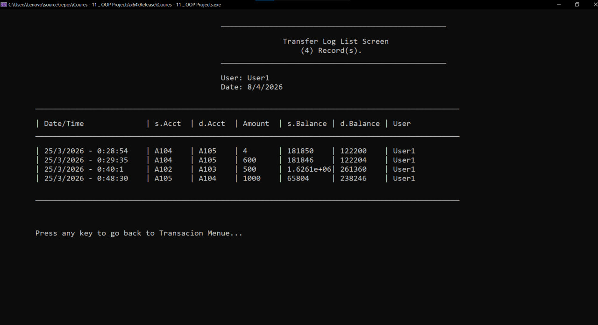
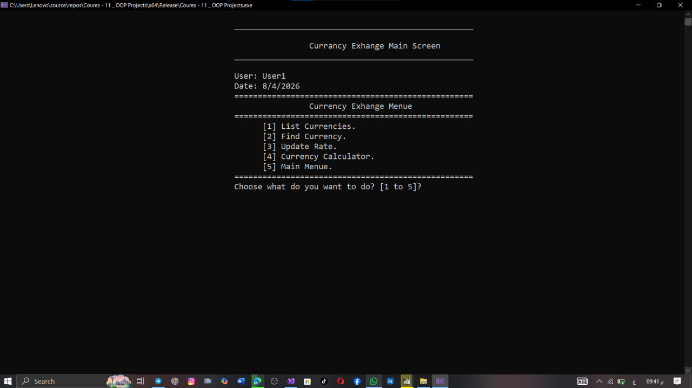

# 
🏦 Enterprise-Grade Bank Management System

  
  
  

---

## 🏗️ Architectural Overview
This system is a demonstration of **High-Level Software Engineering**. It is built using a **Strict Layered Architecture** to ensure industrial-grade maintainability and scalability.

* **⚡ Logic Layer (Core):** Implements complex financial algorithms, business rules, and state management.
* **🖥️ Presentation Layer (Screens):** High-fidelity UI controllers managing user interaction flow.
* **💾 Persistence Layer (Data):** Optimized file-stream handling for text-based databases with data integrity checks.
* **🛠️ Utility Framework (Lib):** Enterprise-grade validation and custom data structures.

---

## 🧠 System Design Highlights
* **Object-Oriented Excellence:** Full implementation of Encapsulation, Abstraction, and Inheritance to reduce code complexity.
* **Modular Design:** Separation of concerns (SoC) allowing each module to be tested and updated independently.
* **Scalable Structure:** Built with a foundation ready for SQL migration and API integration.

---

## 🔐 Advanced Security & Integrity
* **Role-Based Access Control (RBAC):** Granular permission matrix ensuring users only access authorized modules.
* **Session Integrity:** Secure handling of user sessions during system runtime.
* **Input Sanitization:** Robust validation mechanisms to prevent system crashes and exploits.
* **Audit Logging:** Comprehensive logging of all transactions and system activities for auditing.

---

## 📸 System Visual Walkthrough

  <table border="0">
    <tr>
      <td width="50%"> 
<b>🔐 Secure Authentication</b>
</td>
      <td width="50%"> 
<b>🏢 Executive Dashboard</b>
</td>
    </tr>
    <tr>
      <td width="50%"> 
<b>👥 Client Management</b>
</td>
      <td width="50%"> 
<b>💸 Transaction Engine</b>
</td>
    </tr>
    <tr>
      <td width="50%"> 
<b>📜 Transfer Auditing</b>
</td>
      <td width="50%"> 
<b>💱 Currency Management</b>
</td>
    </tr>
  </table>

---

## ⚙️ How to Run
1. **Clone/Download:** Download the repository to your local machine.
2. **Open Project:** Load the `.sln` or `.vcxproj` file in **Visual Studio 2026**.
3. **Configure Data:** Ensure the `.txt` files in the `/Data` folder are present.
4. **Build & Run:** Build the solution and execute the application.

---

  <b>Lead Software Engineer: Oday Al-Naqep</b> 
  <i>Crafting robust solutions through logic, discipline, and OOP principles.</i>

